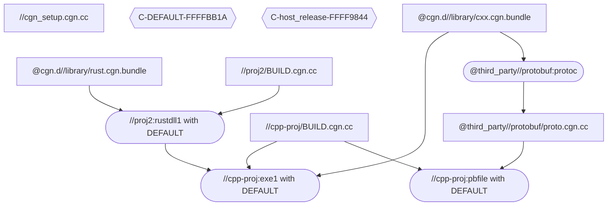

# CGN API 及结构介绍

CGN编译工具链 (c-gen-ninja) 通过解析每一个 BUILD.cgn.cc 生成一系列 build.ninja, 最终由 ninja.exe 完成工程的编译. 分为两个部分 analyst阶段 和 build阶段.
* analyst阶段由 cgn.exe 实现: 编译运行BUILD.cgn.cc 通过其指导生成 build.ninja文件. 在此阶段所有文件依赖、编译参数等均已确定.
    * 用户在此步骤需要传入待编译的 target名称, 接下来 cgn.exe会自动找寻 BUILD.cgn.cc 以及根据该文件记载, 找寻其他依赖并解析之.
    * 解析过程中 cgn.exe 会在其内部生成 Anaysis-Graph, 用于指导 analyst阶段 BUILD.cgn.cc 之间的依赖 以及制作 build.ninja 的位置.
    * 解析完成后 cgn.exe 会返回解析结果 TargetInfos[] 给用户 (通常通过cli pretty print)
* build阶段 由 cgn.exe 间接调用 ninja.exe 执行. 仅作为shortcut调用ninja.exe 从而间接调用编译器, 在此阶段没有额外的 build.ninja 文件生成.

## CGN Analysis Graph
`struct GraphNode`
GraphNode名称为 `S` + script_label
CGN Analysis Graph 中的点, 内部为 “一些文件路径(如下)” 以及 “这些文件是否改动过” 标记, 代表如下三种情况

**代表CGN Script**
(注意: interpreter 和 BUILD.cgn.cc 都是 CGN script)
文件包括
* `cgn-out/analysis_linux/@cell/folder/libBUILD.so` (1st, output)
* `@cell/folder/BUILD.cgn.cc` : BUILD.cgn.cc 或 interpreter脚本例如cmake.cgn.cc
* `@cell/folder/some_hdr.cgn.h` : 同时也有 cc文件内部的include .h (通过compiler /showInclude引入)
* (.rsp / .bundle 形式) .cgn.cc 要求的附加文件 (例如其运行时会读某txt文件)
 
**代表 factory + config 组合**
代表某个target输出的 build.ninja
GraphNode名称为 `T` + factory_label + `#` + ConfigurationID
内部文件列表(仅一条)
* `cgn-out/obj/xxx_AABBCCDD/build.ninja` (1st, output)

**代表 named-config**
GraphNode名称为 `C-` + config_name + `-` + ConfigurationID  
即某个在setup中命名的config, 用于按名称引用config时. 参见 `@third_party//protobuf/proto.cgn.cc` 其中 `protoc` 需要以 `host_release` 编译后作为编译器使用, 但`host_release`对应哪一组配置是不定的 可随时更改的. 故在此需要依赖 “name(host_release) -> config(hash = 0xAABBCCDD) 对应关系”.  
这个点不指向具体文件 其关心的文件列表为空

Note: 我们默认 cgn-out/configuration 属于数据库的一部分, 用户不允许更改, 故在此未关注这个文件夹的mtime.

**样图**


**API.logger**
logger.h 用户打日志的接口 来自Ninjabuild源码中 line_printer.h , 其中
`paragraph()` 用于多行 不自动滚动的日志, 例如一些警告消息
`print()` 用于可以自动滚动的日志 提示进度, 如 `[1/30] ScriptCC xxxxx`. 注意在verbose模式下该函数和`paragraph()`效果相同, 会被保留而不是覆盖.

**API.add_adep_edge(GraphNode *early, GraphNode *late)**
在analysis阶段的依赖图中新增一条边

**API.start_new_round()**
将所有GraphNode标记为unknown, 清除已有的analyse缓存. 再之后用户重新analyse, 有需要的话也会重新编译 -> `dlclose()` -> `dlopen()` 重新挂载dll.

**API.active_script(script_label) => [anode, errmsg]**
挂载CGNScript, 该API允许并行执行. 若并行过程中, 两线程尝试同时active同一个script, 则其中一个会`yield()`等待另一个完成并返回结果.
参数script_label要求必须在CGN Working Root下, 不接受例如`//../other/script.cgn.cc`这样的文件.

**API.offline_script()**
`dlclose()`指定脚本, 以便用户可以删除对应dll文件. 同时遍历AnalysisGraph, 将"该脚本的GraphNode"及"依赖他的所有后续GraphNode"均置为unknown状态, 表明该script可能会有变化, 下次重新检查. (这个函数几乎不会被用到)
注意: 相应的GraphNode 不会从内存和数据库中移除, 为的是下次可以更快加载. (避免重新编译)
有关offline_script()的技术细节, 请参见 DEVNOTE开发笔记

**API.analyse_target(factory_label, cfg) => [CGNTarget, errmsg]**
分析某个target并返回结果, 若label不存在或出现其他错误, 则返回错误信息.
(若fatal error 则会throw exception)

**API.bind_factory(factory_label, func)**
注册一个factory, 最常见的调用者是`active_script()`内部.

**API.init()**
初始化CGN, 仅允许调用一次, 指定了一系列参数如下:
* `scriptcc_debug` CGN Script是否以debug模式编译,  debug模式编译慢, 常用来调试interpreter脚本.
* `verbose` 是否console log 打印详细信息.
* `cgn-out`=string 指定输出目录. 该目录允许相对路径(相对于当前working-root), 也允许绝对路径(包括其他盘符). 举例: windows机访问 位于区分大小写的SAMBA共享下的源码. 因未知bug, 常有无法写入文件的错误, 也有时间戳的问题, 尤其发生在ninja.exe运行过程中. 另外有些外部脚本的bug, win不支持case-sensitive.
* `winenv` 运行 `C:\\Program Files\\Microsoft Visual Studio\\2022\\Community\\VC\\Auxiliary\\Build\\vcvars64.bat` 然后从中获得PATH等环境变量.
* `script_cc`=string 指定CGN Script编译器, 在windows下接受cl.exe, 在linux/mac下接受 clang++/g++. 注意该参数与`winenv`不冲突. 若不指定, windows下默认为`cl.exe`, linux下默认为`g++`, mac下默认为`clang++`.

**API.release()**
释放所有资源, 程序退出时调用.
由于在正常退出时, cgn.h中定义的全局变量`api`, 受c++限制无法保证和其他dll的析构顺序, 故在此手工release().


## Struct `CGNTargetOpt / CGNTargetOptIn`
`CGNTargetOptIn` 表示config未确认之前的信息, 包含 src_prefix等
`CGNTargetOpt` 表示确定config不再更改以及不再访问陌生字段后的信息, 包含out_prefix等

`CGNTargetOptIn` 通过`opt.confirm()` 或 `opt.confirm_with_error()` 生成 `CGNTargetOpt`, 可以confirm多次.

```cpp
struct CGNTargetOpt {
    //以下 CGNTargetOptIn 阶段可用 (before confirm)
    //-------------------------------------------

    // 这几项在当前target 以及 sub-unit-target中均不变
    const string factory_name;
    const string factory_label;
    const string src_prefix;

    // 喂给当前factory的 configuration, 在confirm之后不能访问"之前没访问过的字段".
    Configuration cfg;

    // 通过调用 optin.quick_dep() 新增这些字段
    vector<string/GraphNode*> quickdep_xxx;

    //以下 CGNTargetOpt 阶段才能获得 (after confirm)
    //-------------------------------------------

    // 默认的 build.ninja 文件 (sub-target有其自己的 build.ninja)
    NinjaFile *ninja;

    // 当前target的 anode (sub-target有其自己的 anode)
    GraphNode *anode;
    
    // cgn-out下的输出路径 (sub-target有其自己的 输出路径)
    string out_prefix;

    // 是否在confirm()时找到上一次的缓存, 如果为true, interpreter应立即返回.
    // (找到缓存的话, this->anode 及 this->ninja 均为 nullptr)
    bool cache_result_found;
    CGNTarget result;
}
```